# Tugas 2 - Desain Database Perpustakaan

Dokumen ini berisi penjelasan setiap query, hasil implementasi, serta screenshot dari database perpustakaan.

---

## Query 1: Membuat tabel `kategori_buku`
Query ini digunakan untuk membuat tabel kategori.

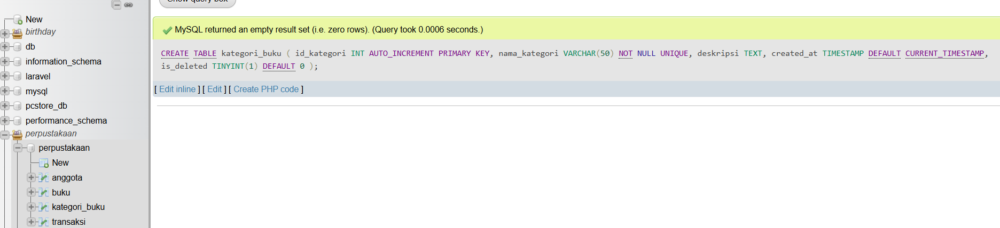

---

## Query 2: Membuat tabel `penerbit`
Query ini digunakan untuk membuat tabel penerbit.

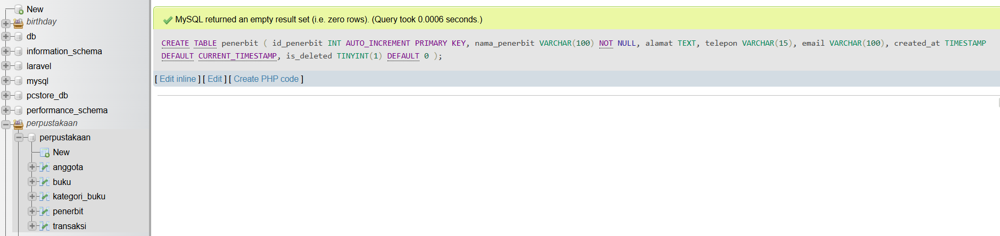

---

## Query 3: Membuat tabel `rak`
Query ini digunakan untuk membuat tabel rak sebagai lokasi penyimpanan buku.

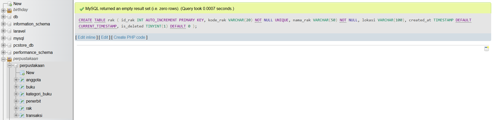

---

## Query 4: Insert data kategori buku
Query ini digunakan untuk menambahkan data kategori buku.

### Isi tabel kategori_buku
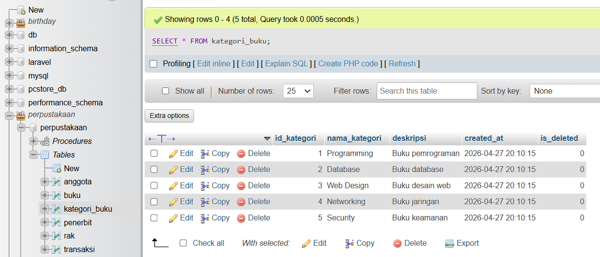

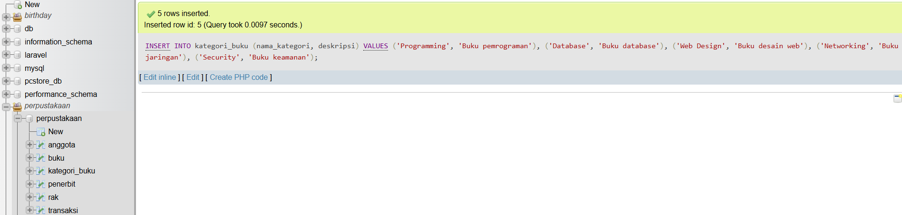

---

## Query 5: Insert data penerbit
Query ini digunakan untuk menambahkan data penerbit.

### Isi tabel penerbit
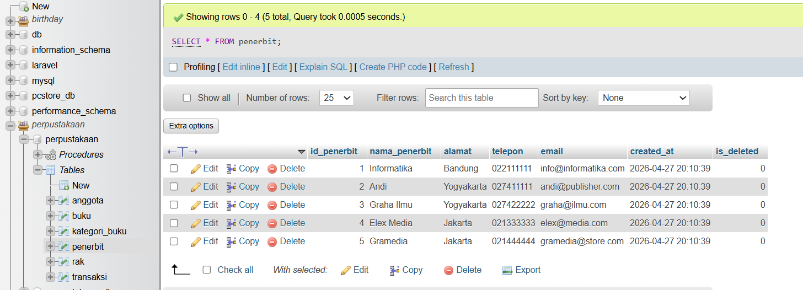

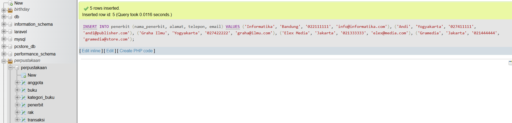

---

## Query 6: Insert data rak
Query ini digunakan untuk menambahkan data rak.

### Isi tabel rak
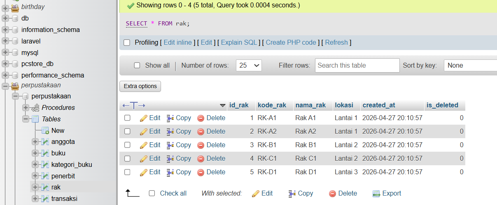

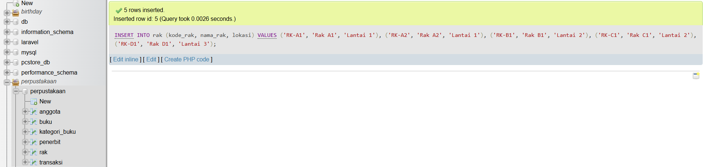

---

## Query 7: Menambahkan kolom relasi pada tabel buku
Query ini digunakan untuk menambahkan kolom:
- id_kategori
- id_penerbit
- id_rak

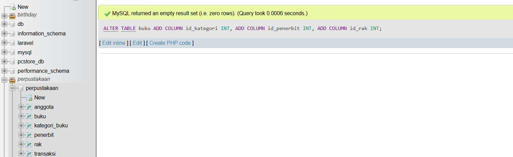

---

## Query 8: Mapping kategori lama
Query ini digunakan untuk menghubungkan kategori lama ke tabel kategori_buku.

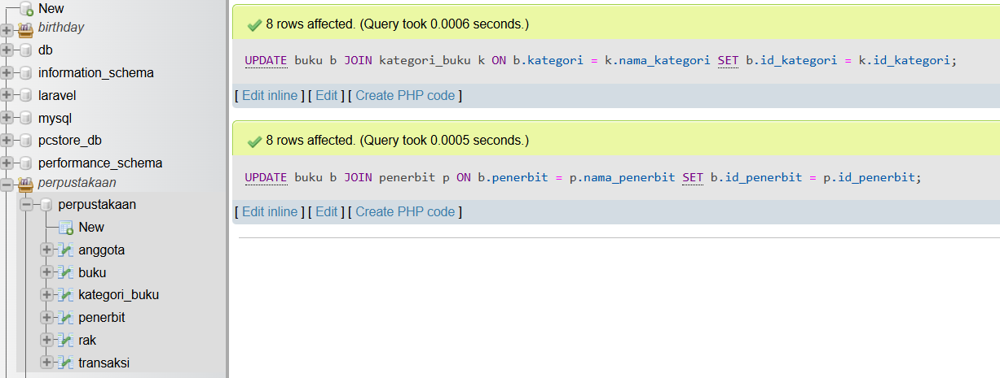

---

## Query 9: Mapping penerbit lama
Query ini digunakan untuk menghubungkan penerbit lama ke tabel penerbit.

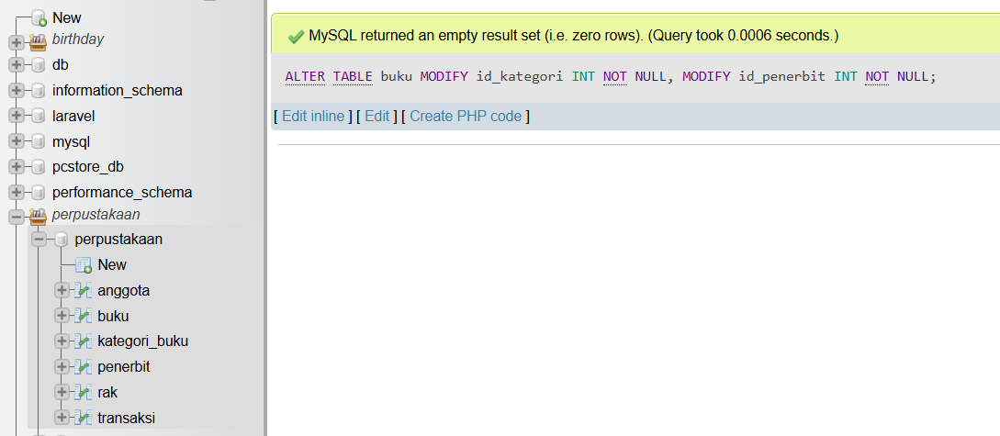

---

## Query 10: Menambahkan foreign key
Query ini digunakan untuk membuat relasi antar tabel menggunakan foreign key.

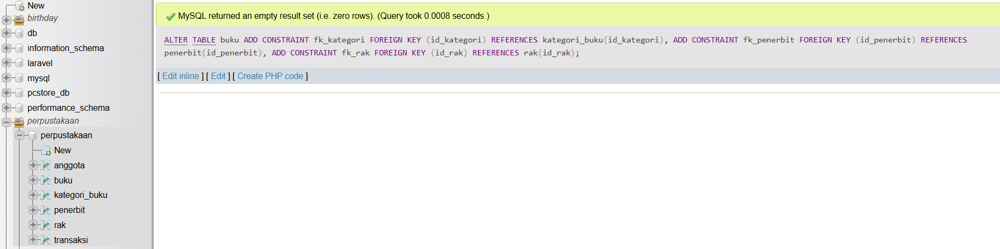

---

## Query 11: Menghapus kolom lama
Query ini digunakan untuk menghapus kolom kategori dan penerbit lama.

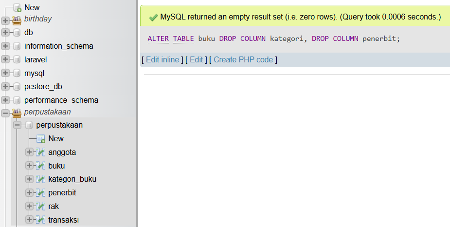

---

## Query 12: Menambahkan 12 buku baru
Query ini digunakan untuk memenuhi minimal jumlah buku.

### Isi tabel buku


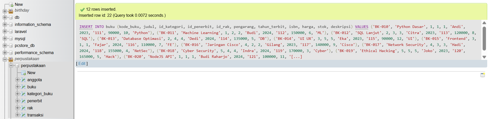

---

## Query 13: JOIN buku, kategori, penerbit
Query ini digunakan untuk menampilkan data buku beserta kategori dan penerbit.

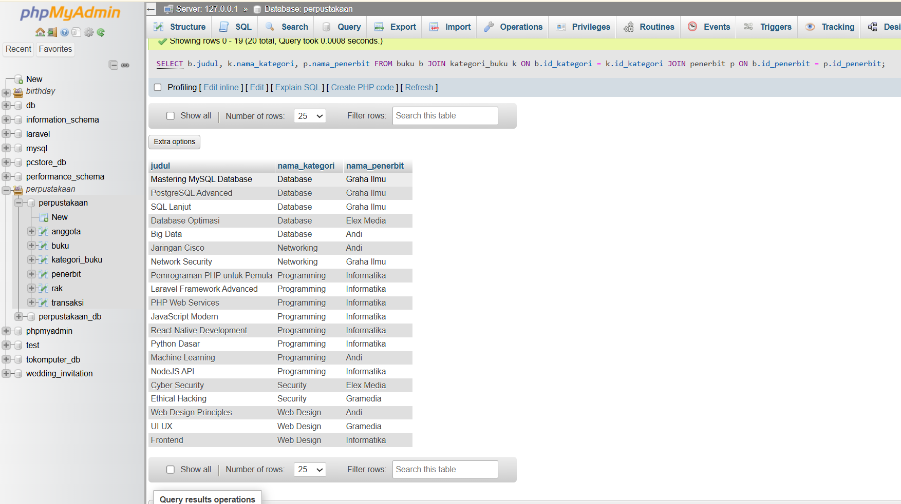

---

## Query 14: Jumlah buku per kategori
Query ini digunakan untuk menghitung jumlah buku per kategori.

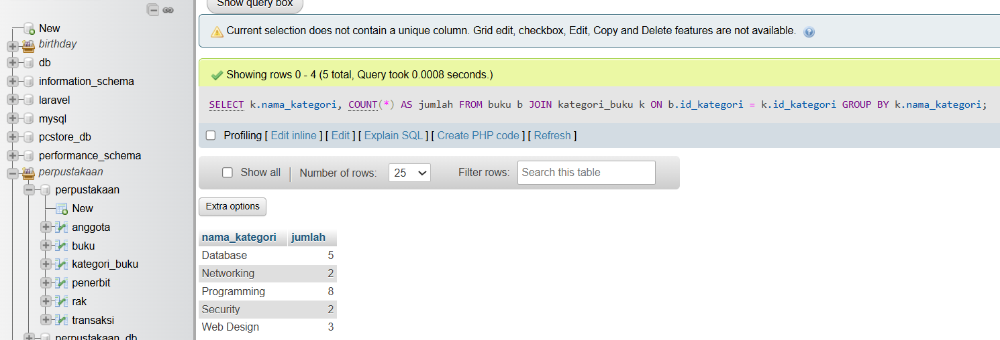

---

## Query 15: Jumlah buku per penerbit
Query ini digunakan untuk menghitung jumlah buku per penerbit.

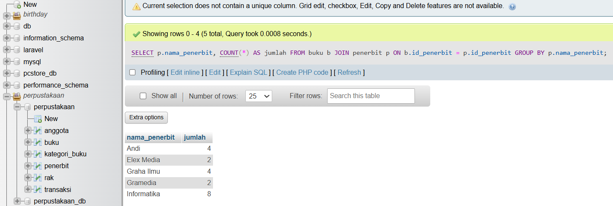

---

## Query 16: Detail lengkap buku
Query ini digunakan untuk menampilkan semua informasi buku.

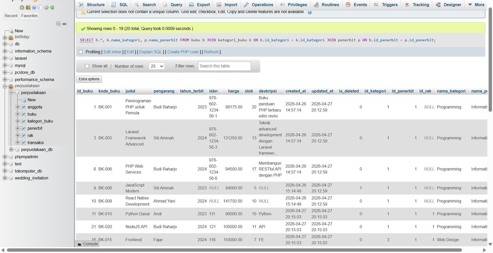

---

## Query 17: Implementasi soft delete
Query ini digunakan untuk menambahkan kolom is_deleted.

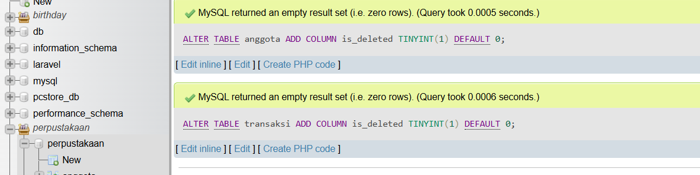

---

## Data Tabel Tambahan

### Isi tabel anggota
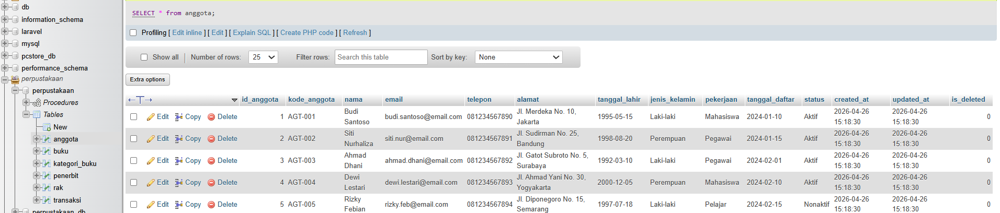

### Isi tabel transaksi
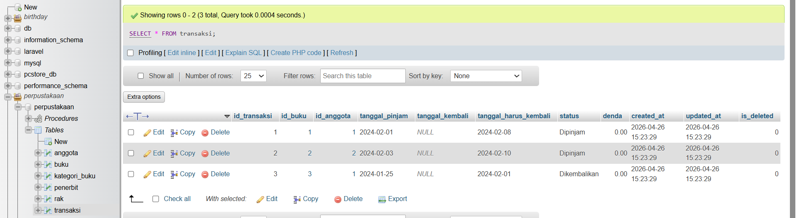

---

## Query 18: Stored Procedure
Query ini digunakan untuk membuat procedure agar query JOIN bisa dipanggil ulang.

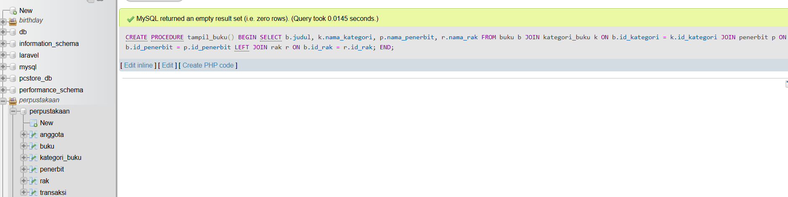 

### Cara Pakai
Untuk menjalankan stored procedure, gunakan perintah berikut:

```sql
CALL tampil_buku();
```

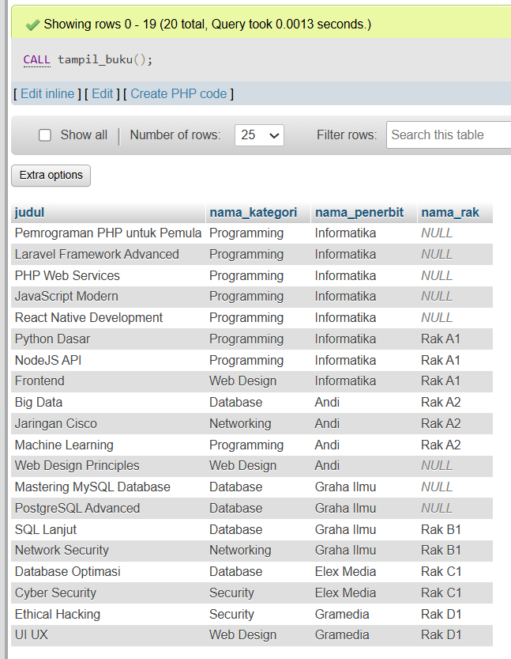 

---

## ERD Database Perpustakaan

ERD menggambarkan hubungan antar tabel dalam database.

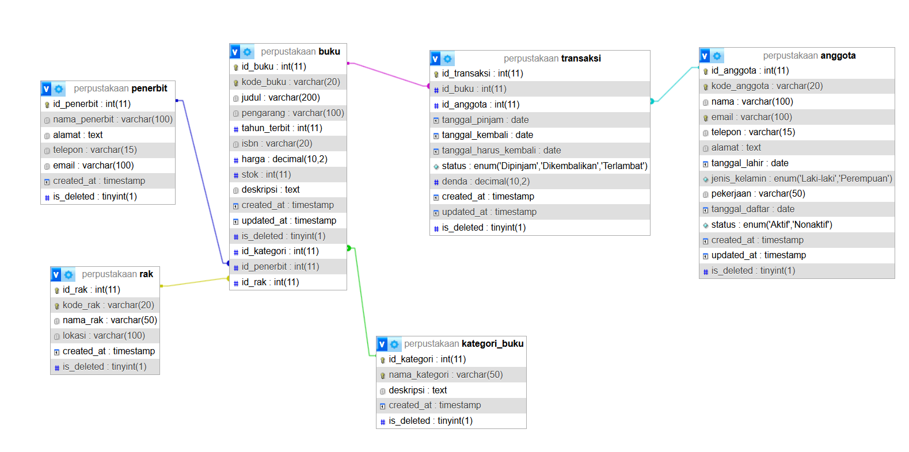

---
